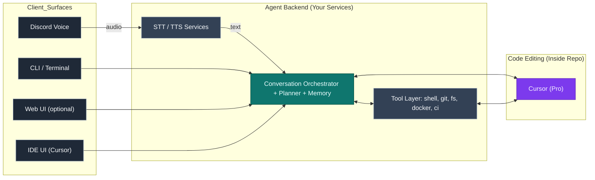
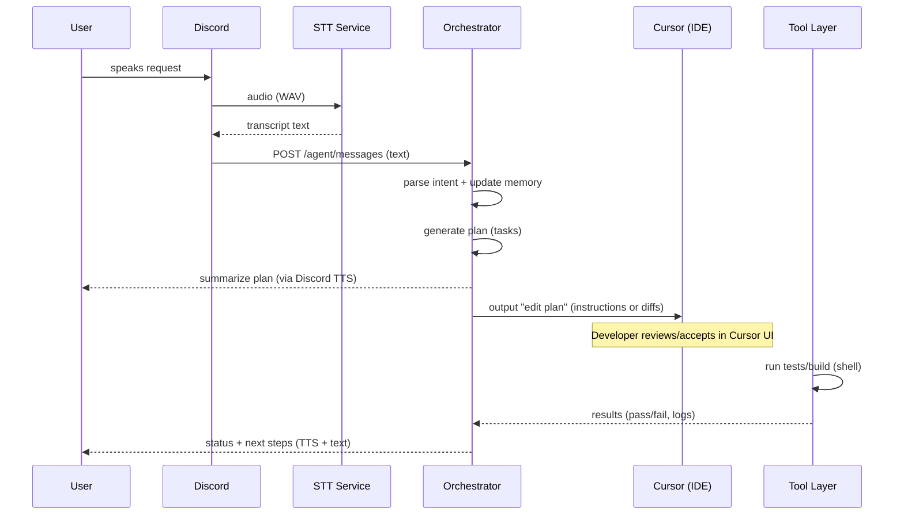
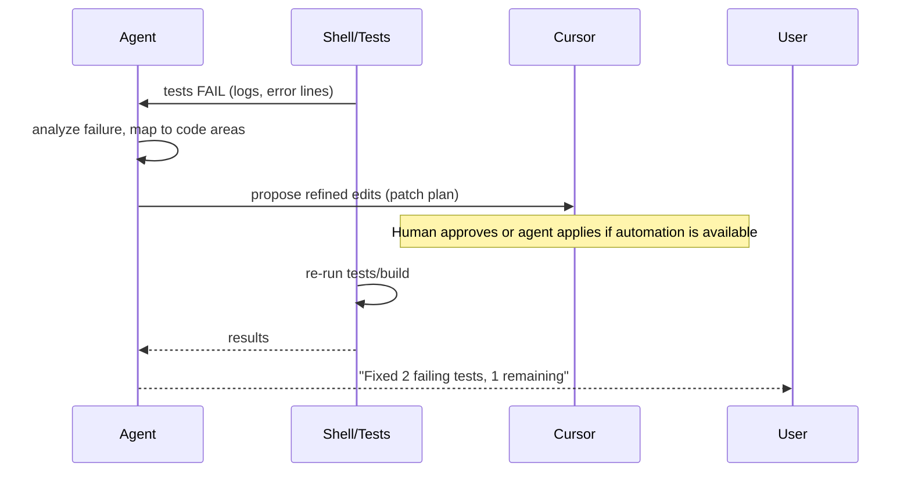

# Project Architecture

> **Purpose**  
> This document captures the high-level architecture, design decisions, and integration plan for evolving the current Discord voice bot into a **voice-driven engineering agent** that collaborates via speech, plans work, edits code through **Cursor**, executes tests/builds locally, and reports back (voice + text). It’s written for developers onboarding to the project.

---

## 1) Big Picture

### 1.1 Vision

A self-hosted, voice-first engineering assistant that can:
- Converse (voice) to gather intent.
- Plan multi-step work.
- Edit code **inside your repo** using Cursor.
- Run tests/builds, inspect logs, and iterate.
- Report progress and results (voice + text).
- Persist memory across sessions/projects.

### 1.2 High-Level System Diagram



**Key separation of concerns**

* **Cursor** = *inner loop* (multi-file reasoning, diffs, refactors, tests scaffolding).
* **Agent Backend** = *outer loop* (voice, planning, orchestration, tool execution, memory).
* **Surfaces** = interchangeable UIs (Discord, CLI, Web, etc.).

---

## 2) Components & Responsibilities

### 2.1 Conversation Orchestrator (Core)

* **Responsibilities**

  * Session + long-term **memory** (project goals, decisions, constraints).
  * **Intent parsing**: from user utterances to structured tasks.
  * **Planning**: decompose big goals into steps; maintain a task graph.
  * **Execution loop**: pick next action → call tool (Cursor, shell, git) → evaluate → iterate.
  * **Summarization** of outcomes/status back to user (text + voice).
* **Interfaces**

  * `POST /agent/messages`: user inputs (voice-transcribed text or text).
  * `POST /agent/plan`: propose/commit a plan (list of tasks with dependencies).
  * `POST /agent/execute`: run next step or a specific task ID.
  * `GET  /agent/state`: current plan, active task, memory snippets.
  * `GET  /agent/logs`: recent tool outputs (build, test, git, etc.).

### 2.2 STT / TTS Services (Existing)

* **STT**: FastAPI + faster-whisper (`POST /asr`) → text.
* **TTS**: Piper (`POST /api/tts`) → WAV.
* Used by the orchestrator and the Discord bot.

### 2.3 Tool Layer (Your Adapters)

* **Shell Runner**: bounded command execution with timeouts; returns stdout/stderr/exit code.
* **Git Adapter**: branch, commit, diff, push, open PR (optional), status.
* **FS Adapter**: read/write files, list tree (with guardrails).
* **Docker/K8s** (optional): build/run containers, deploy services.
* **CI/CD Triggers** (optional): GitHub Actions/other to run pipelines.
* **Design Goals**

  * **Idempotent + observable**: every call returns structured results.
  * **Safety**: configured allow-list of commands; working directory sandboxes.
  * **Deterministic**: explicit environment (PATHs, env vars) and resource limits.

### 2.4 Cursor Integration (Pro)

* **What we rely on Cursor for**

  * Multi-file code edits and refactors.
  * Tests/documentation scaffolding.
  * Deep context about the repo and language/server frameworks.
* **Integration Model**

  * **Primary**: Use Cursor as the developer’s IDE; the agent produces *tasks/prompts* formatted for Cursor. Developer approves diffs in Cursor UI.
  * **Advanced**: If/when Cursor exposes a (documented) API/automation hooks, the agent can trigger “apply plan” steps; otherwise, the human-in-the-loop applies generated edit plans.

> **Note**: Because Cursor’s external automation surface may be limited, the baseline integration assumes:
>
> * The **agent outputs precise edit instructions** (file-level patch proposals) to be pasted/accepted in Cursor, or
> * The agent uses a local **code-diff generator** (e.g., LLM or tree-sitter-based) to create unified diffs that a developer can apply, while still leveraging Cursor for IDE support.

---

## 3) Canonical Flows

### 3.1 Voice → Code Change → Test → Report



### 3.2 Iterative Fix Loop (Red/Green)



---

## 4) Technical Integration Plan

### 4.1 Orchestrator Service (Go or Python)

* **Choice**: You can keep the bot in Go and implement the Orchestrator in Go for coherence, or implement the Orchestrator in Python (faster for tooling/LLM flows). Both are viable.
* **Endpoints (example)**

  * `POST /agent/messages`

    * **Input**: `{ sessionId, text, surface, metadata }`
    * **Output**: `{ replyText, planDelta, nextAction }`
  * `POST /agent/plan`

    * **Input**: `{ sessionId, goal, tasks[] }`
    * **Output**: `{ planId, validatedTasks[] }`
  * `POST /agent/execute`

    * **Input**: `{ planId, taskId }`
    * **Output**: `{ taskResult, artifacts, nextSuggestedTask }`
  * `GET /agent/state?sessionId=...`

    * **Output**: `{ memorySnippets, plan, recentLogs }`
  * `GET /agent/logs?taskId=...`

    * **Output**: `{ stdout, stderr, exitCode, duration }`
* **Memory**

  * Start simple: JSONL or SQLite for session memory and decision logs.
  * Evolve to vector store (e.g., sqlite-vss) for semantic retrieval if needed.

### 4.2 Cursor Interaction

* **Baseline (Human-in-the-loop)**

  * The agent emits **precise, copy-pasteable** “edit plans”:

    * File paths to create/modify.
    * Unified diffs or “apply these changes” blocks.
    * Rationale and safety notes (why this change is safe).
  * Developer pastes the plan into Cursor’s Composer and accepts diffs.
* **If API/Hooks are available**

  * Wrap as a **Cursor Client** with:

    * `ProposeDiffs(repoPath, prompt | plan) -> ProposedPatch[]`
    * `ApplyPatch(repoPath, patch)` (careful with conflicts)
  * Ensure **idempotency**: the same plan must not corrupt the repo when retried.

### 4.3 Tool Layer (Go)

* **Shell Runner**

  * `POST /tools/shell`: `{ cmd, args[], cwd, env[], timeoutMs }`
  * Response contains captured `stdout`, `stderr`, `exitCode`, `durationMs`.
  * Implement explicit **allow-list** of commands (e.g., `go`, `npm`, `make`, `pytest`).
* **Git Adapter**

  * `POST /tools/git`: `{ op: 'status'|'branch'|'commit'|'push' , args }`
  * Return structured objects, not raw text, where feasible.
* **FS Adapter**

  * `GET /tools/fs/read?path=...`
  * `POST /tools/fs/write`: `{ path, content, mode }`
  * Guard: repo root sandbox, path normalization.

### 4.4 Discord Bot (Go)

* Treat the **Discord bot** as a **client** of the Orchestrator.
* Minimal logic:

  * Capture voice → STT → send text to `/agent/messages`.
  * Speak back via TTS with agent’s reply/status.
  * Optional: register slash commands (`/plan`, `/status`, `/run tests`).

---

## 5) Design Decisions & Trade-offs

### 5.1 Cursor as the “Inner Loop”

* **Pros**: best-in-class multi-file reasoning, diffs, refactors; human control remains tight.
* **Cons**: automation is constrained by UI; external APIs may be limited.
* **Mitigation**: start human-in-the-loop; add automation hooks only when stable.

### 5.2 Orchestrator Language

* **Go**: aligns with bot, great concurrency, simple deploys.
* **Python**: rich ecosystem for LLM tooling, fast prototyping of tools.
* **Decision**: start with **Go** to reduce stack spread; optionally host a small Python “tools sidecar” later for specialized tasks.

### 5.3 Safety & Guardrails

* Strict **allow-list** for shell commands.
* Repo sandbox; **no absolute writes** outside repo root.
* Timeouts + resource limits for long-running processes.
* Clear **confirmation gates** for destructive operations (db migrations, deploys).

### 5.4 Memory

* Start with **lightweight JSON/SQLite** (sessions, decisions, artifact pointers).
* Record: goals, accepted plans, commands run, outputs, elapsed time.
* Allow “forget” commands to clean sensitive history.

### 5.5 Observability

* Structured logs (JSON) with correlation IDs (`sessionId`, `planId`, `taskId`).
* Optional **Prometheus** metrics:

  * Task duration, success/failure rate, test pass rate, STT latency.

---

## 6) Configuration & Environments

### 6.1 Environment Variables (examples)

```
# Discord
DISCORD_BOT_TOKEN=...
GUILD_ID=...
VOICE_CHANNEL_ID=...

# Agent
AGENT_HTTP_ADDR=127.0.0.1:7000
MEMORY_PATH=/var/lib/agent/memory.db

# LLM (local llama.cpp server via OpenAI shape)
OPENAI_BASE_URL=http://127.0.0.1:8000/v1
OPENAI_API_KEY=local-key
OPENAI_MODEL=local

# STT / TTS
WHISPER_URL=http://127.0.0.1:9000/asr
TTS_URL=http://127.0.0.1:8080/api/tts

# Tooling
REPO_ROOT=/home/dev/workspace/project
SHELL_ALLOWLIST="go,npm,yarn,pnpm,pytest,make,git,docker"
SHELL_TIMEOUT_MS=120000
```

### 6.2 Dev (WSL2)

* Run STT/LLM/TTS locally.
* Run Orchestrator on `127.0.0.1:7000`.
* Use Cursor in your IDE; accept diffs from agent plans.

### 6.3 Prod (Synology / Docker)

* Containerize:

  * `orchestrator` (Go)
  * `stt` (FastAPI)
  * `tts` (Piper)
  * `llm` (llama.cpp)
  * `bot` (Discord)
* Bind mount the repo volume; strictly scope tool access.
* Limit network exposure (`localhost`/LAN only).

---

## 7) Implementation Roadmap

1. **Orchestrator skeleton (Go)**

   * `/agent/messages`, `/agent/state`, basic memory (SQLite).
   * Integrate existing STT/TTS clients.
2. **Tool Layer v1**

   * Shell + Git + FS adapters with allow-lists and timeouts.
3. **Cursor “edit plan” output**

   * Produce structured edit instructions and unified diffs.
   * Add a “copy plan to clipboard” helper for developers.
4. **Iterative loop**

   * Test execution + failure analysis → regenerate edit plan.
5. **Discord client**

   * Convert voice to text → `/agent/messages` → speak reply.
6. **Docs + Examples**

   * Sample end-to-end scenario (e.g., “add auth middleware”).
7. **(Optional) Automation**

   * If feasible, integrate any Cursor automation hooks or build a local diff applier with human confirmation.

---

## 8) Developer FAQ

**Q: Why split “inner” and “outer” loops?**
A: Cursor is optimized for editing inside a repo. The agent must orchestrate tasks outside editing: voice UX, planning, running commands, CI, memory.

**Q: Can the agent apply diffs automatically?**
A: Yes, via our FS/Git tools, but we recommend **human approval** for safety. Start with human-in-the-loop, then add opt-in automation.

**Q: Do we have to use Discord?**
A: No. Discord is one surface. The Orchestrator is UI-agnostic; we can add a Web UI or CLI easily.

**Q: What about RAG / project docs?**
A: Add a simple retrieval layer (vector store) later; not required for MVP.

---

## 9) Appendices

### 9.1 Example: Edit Plan Payload (from Orchestrator to Developer/Cursor)

```json
{
  "goal": "Add JWT auth middleware and tests",
  "rationale": "Protect /api/* routes; issue/validate tokens",
  "changes": [
    {
      "path": "internal/auth/middleware.go",
      "action": "create",
      "language": "go",
      "content": "// file contents here ..."
    },
    {
      "path": "cmd/api/main.go",
      "action": "modify",
      "patch": "@@ ... unified diff ..."
    },
    {
      "path": "internal/auth/middleware_test.go",
      "action": "create",
      "language": "go",
      "content": "// tests ..."
    }
  ],
  "post_steps": [
    "go mod tidy",
    "make test",
    "run server and hit /health with token"
  ]
}
```

### 9.2 Example: Shell Tool Call

```json
{
  "cmd": "make",
  "args": ["test", "-j4"],
  "cwd": "/home/dev/workspace/project",
  "timeoutMs": 120000,
  "env": ["GOFLAGS=-count=1"]
}
```

---

## 10) Summary

* Treat **Cursor** as the **editing brain** inside the repo.
* Build an **Orchestrator** for voice, planning, tools, memory, and UX.
* Keep **safety** (allow-lists, timeouts, approvals) front-and-center.
* Start **human-in-the-loop**; add automation thoughtfully.

> This separation lets you scale from a fun Discord bot to a robust **voice-driven engineering partner**—without rewriting your core as you add surfaces (CLI, Web, IDE).
