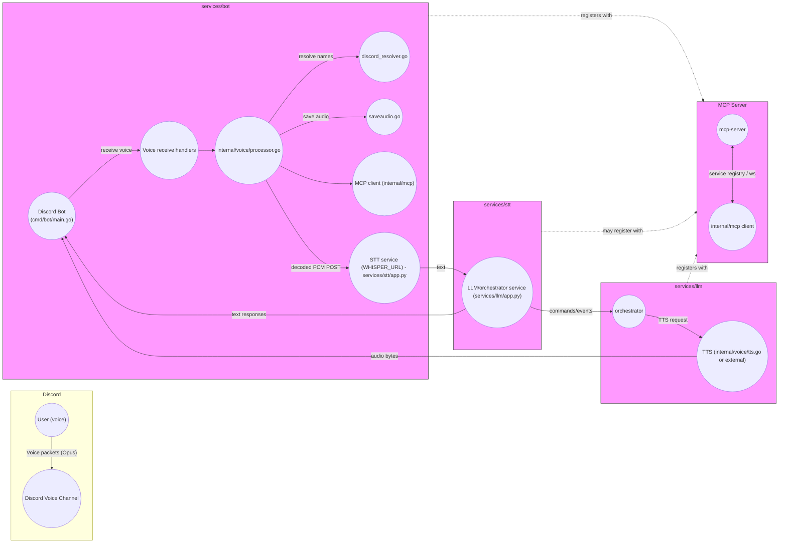

# Architecture Diagram (Mermaid)

## Notes

- The central audio path is: Discord (Opus frames) -> Bot receives -> Processor decodes Opus to PCM -> POST to STT (WHISPER_URL) -> text to LLM -> orchestrator issues TTS -> Bot plays audio back to voice channel.
- MCP (services/mcp-server) provides service discovery and a WebSocket bridge used by `services/llm` and `services/bot`.
- Important files: `cmd/bot/main.go`, `internal/voice/processor.go`, `internal/voice/whisper_client.go`, `services/stt/app.py`, `services/llm/app.py`, `mcp-server/main.go`.
