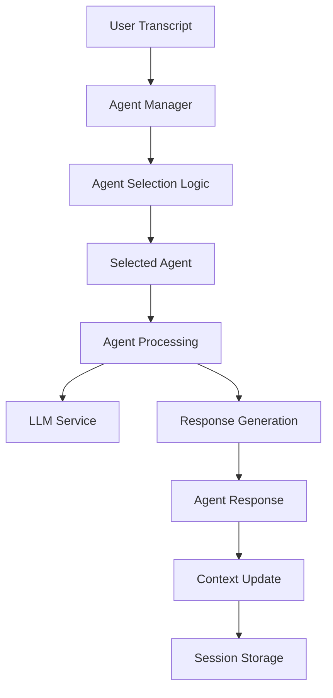

<!-- markdownlint-disable-next-line MD041 -->
> Docs ▸ Architecture ▸ Agent System

# Agent System Architecture

The agent system provides a flexible framework for intelligent response generation through specialized agents. Each agent handles specific types of interactions and can be combined to create sophisticated conversational experiences.

## System Overview



## Core Components

### Agent Manager

The `AgentManager` coordinates agent selection and routing:

```python
class AgentManager:
    """Manages agent selection and routing."""

    async def select_agent(
        self,
        transcript: str,
        context: ConversationContext
    ) -> BaseAgent:
        """Select appropriate agent for input."""
        # Agent selection logic
        # Priority handling
        # Context analysis
        # Fallback handling
```

**Key Features:**

-  **Agent Selection**: Routes input to appropriate agents
-  **Priority Management**: Handles agent priority and conflicts
-  **Context Analysis**: Uses conversation context for selection
-  **Fallback Handling**: Provides default agent when no match found

### Agent Registry

The `AgentRegistry` manages available agents:

```python
class AgentRegistry:
    """Registry for managing agents."""

    def register(self, name: str, agent: BaseAgent) -> None:
        """Register an agent."""
        # Agent registration
        # Validation
        # Statistics tracking
        # Health monitoring
```

**Registry Features:**

-  **Agent Registration**: Dynamic agent registration and removal
-  **Validation**: Ensures agent compatibility and correctness
-  **Statistics**: Tracks agent usage and performance
-  **Health Monitoring**: Monitors agent health and availability

### Base Agent Interface

All agents implement the `BaseAgent` interface:

```python
class BaseAgent(ABC):
    """Abstract base class for all agents."""

    @property
    @abstractmethod
    def name(self) -> str:
        """Return the agent name."""
        pass

    @abstractmethod
    async def handle(
        self,
        context: ConversationContext,
        transcript: str
    ) -> AgentResponse:
        """Process user input and generate response."""
        pass

    def can_handle(self, transcript: str, context: ConversationContext) -> bool:
        """Check if this agent can handle the input."""
        return True
```

## Built-in Agents

### Echo Agent

Simple agent for testing and basic responses:

```python
class EchoAgent(BaseAgent):
    """Agent that echoes user input back."""

    @property
    def name(self) -> str:
        return "echo"

    async def handle(
        self,
        context: ConversationContext,
        transcript: str
    ) -> AgentResponse:
        """Echo the user input."""
        return AgentResponse(
            response_text=f"You said: {transcript}",
            metadata={"agent": self.name}
        )
```

**Use Cases:**

-  **Testing**: Basic functionality testing
-  **Debugging**: Simple response validation
-  **Fallback**: Default response when no other agent matches

### Conversation Agent

Natural multi-turn conversation agent:

```python
class ConversationAgent(BaseAgent):
    """Agent for natural multi-turn conversations."""

    async def handle(
        self,
        context: ConversationContext,
        transcript: str
    ) -> AgentResponse:
        """Generate contextual response using conversation history."""
        # Build conversation history
        # Call LLM service
        # Generate response
        # Update context
```

**Features:**

-  **Context Awareness**: Uses conversation history
-  **LLM Integration**: Calls LLM service for reasoning
-  **Multi-turn Support**: Maintains conversation flow
-  **Response Generation**: Creates natural responses

### Summarization Agent

Agent for summarizing conversation history:

```python
class SummarizationAgent(BaseAgent):
    """Agent that summarizes conversation history."""

    async def handle(
        self,
        context: ConversationContext,
        transcript: str
    ) -> AgentResponse:
        """Generate summary of conversation history."""
        # Check for summarization requests
        # Build history summary
        # Call LLM for summarization
        # Return summary
```

**Features:**

-  **History Analysis**: Analyzes conversation history
-  **Summary Generation**: Creates concise summaries
-  **Context Preservation**: Maintains important context
-  **Trigger Detection**: Recognizes summarization requests

### Intent Agent

Agent for intent classification and routing:

```python
class IntentAgent(BaseAgent):
    """Classifies user intent and routes to specialized agents."""

    async def handle(
        self,
        context: ConversationContext,
        transcript: str
    ) -> AgentResponse:
        """Classify intent and route to appropriate agent."""
        # Intent classification
        # Agent selection
        # Route to specialized agent
        # Return response
```

**Features:**

-  **Intent Classification**: Identifies user intent
-  **Agent Routing**: Routes to specialized agents
-  **Context Analysis**: Uses conversation context
-  **Fallback Handling**: Provides default responses

## Agent Lifecycle

### 1. Agent Registration

-  Agents are registered with the agent manager
-  Configuration and validation are performed
-  Health checks are initialized

### 2. Agent Selection

-  Input is analyzed for agent compatibility
-  Context is considered for selection
-  Priority and routing rules are applied

### 3. Agent Processing

-  Selected agent processes the input
-  External services (LLM) are called as needed
-  Response is generated and validated

### 4. Context Update

-  Conversation context is updated
-  Session state is persisted
-  Statistics are recorded

### 5. Response Delivery

-  Response is sent to output adapters
-  Audio synthesis is performed if needed
-  User receives the response

## Configuration

### Agent Configuration

```bash
# Agent System Configuration
AGENT_DEFAULT=conversation
AGENT_ROUTING_ENABLED=true
AGENT_MAX_HISTORY=10
AGENT_TIMEOUT_MS=30000

# LLM Service Configuration
LLM_SERVICE_URL=http://llm:8000
LLM_TIMEOUT_MS=30000
LLM_MAX_TOKENS=2048

# External Service Integration
EXTERNAL_SERVICES_TIMEOUT_MS=10000
```

### Agent-Specific Configuration

```bash
# Echo Agent
ECHO_AGENT_ENABLED=true
ECHO_AGENT_PRIORITY=1

# Conversation Agent
CONVERSATION_AGENT_ENABLED=true
CONVERSATION_AGENT_MAX_HISTORY=10
CONVERSATION_AGENT_TEMPERATURE=0.7

# Summarization Agent
SUMMARIZATION_AGENT_ENABLED=true
SUMMARIZATION_AGENT_MIN_TURNS=5
SUMMARIZATION_AGENT_TRIGGER_KEYWORDS=summarize,summary,recap
```

## Error Handling

### Agent Errors

-  **Agent Failure**: Graceful fallback to default agent
-  **Timeout Handling**: Configurable timeouts and retries
-  **Resource Limits**: Memory and CPU usage monitoring
-  **External Service Failures**: LLM service error handling

### Context Errors

-  **Session Corruption**: Session recovery and cleanup
-  **Context Loss**: Context reconstruction and validation
-  **Storage Failures**: Fallback to in-memory storage
-  **Data Corruption**: Data validation and repair

## Monitoring and Metrics

### Agent Metrics

-  **Agent Usage**: Frequency and success rates
-  **Response Times**: Processing latency per agent
-  **Error Rates**: Failure rates and error types
-  **Resource Usage**: CPU and memory consumption

### System Metrics

-  **Agent Selection**: Selection accuracy and performance
-  **Context Management**: Context size and update frequency
-  **External Calls**: LLM service performance
-  **Overall Performance**: End-to-end response times

## Best Practices

### Agent Development

-  **Single Responsibility**: Each agent should have a clear purpose
-  **Error Handling**: Implement comprehensive error handling
-  **Testing**: Write thorough tests for all agent functionality
-  **Documentation**: Document agent behavior and configuration

### Performance

-  **Async Operations**: Use async/await for I/O operations
-  **Resource Management**: Monitor and limit resource usage
-  **Caching**: Cache expensive operations when appropriate
-  **Optimization**: Profile and optimize critical paths

### Integration

-  **LLM Integration**: Handle LLM service failures gracefully
-  **Context Management**: Maintain conversation context efficiently
-  **Response Generation**: Generate consistent and useful responses
