<!-- markdownlint-disable-next-line MD041 -->
> Docs ▸ Architecture ▸ Audio Enhancement Pipeline

# Audio Enhancement Pipeline Architecture

This document explains when and why audio enhancement is used in the audio-orchestrator voice pipeline.

## Overview

The audio pipeline uses **two distinct enhancement stages** optimized for different purposes:

1.  **Frame-Level Processing** (Discord, Real-Time) - Lightweight preprocessing
2.  **Segment-Level Enhancement** (STT, Batch) - Heavy ML-based enhancement

## Complete Pipeline Flow

```mermaid
flowchart TD
    Discord[Discord Voice Packets<br/>48kHz PCM] --> FrameProc[Frame Processing<br/>Audio Processor Service]
    FrameProc --> |VAD + Normalization| ProcessedFrame[Processed Frame<br/>Normalized PCM]
    ProcessedFrame --> Segment[Segment Creation<br/>Discord Service]
    Segment --> WAVEnc[WAV Encoding<br/>48kHz → 16kHz]
    WAVEnc --> |16kHz WAV| STTEnhance[STT Enhancement<br/>Audio Processor Service]
    STTEnhance --> |MetricGAN+ ML| EnhancedWAV[Enhanced WAV<br/>MetricGAN+ Processed]
    EnhancedWAV --> Transcription[faster-whisper<br/>STT Service]
    Transcription --> Transcript[Transcript Text]
```



## Stage 1: Frame-Level Processing (Discord)

**Location**: `services/discord/audio_processor_wrapper.py` → `services/audio` `/process/frame`

**When**: Every voice packet received from Discord (~20ms frames)

**What Happens**:

```python
# services/audio/processor.py
async def process_frame(frame: PCMFrame) -> PCMFrame:
    # 1. Voice Activity Detection (VAD)
    if config.enable_vad:
        frame = await _apply_vad(frame)

    # 2. Basic normalization
    frame = await self._normalize_frame(frame)
```

**Enhancement Level**: ⚡ **Lightweight (CPU-only)**

-  ✅ WebRTC VAD (Voice Activity Detection)
-  ✅ RMS-based volume normalization
-  ❌ NO MetricGAN+ (too expensive for real-time)
-  ❌ NO ML-based noise reduction

**Purpose**:

-  Real-time filtering for wake detection
-  Volume consistency across frames
-  Silence/speech detection

**Latency Requirement**: <20ms per frame (real-time constraint)

**GPU Used**: ❌ None (CPU-only operations)

---

## Stage 2: Segment-Level Enhancement (STT)

**Location**: `services/stt/app.py` → `services/audio` `/enhance/audio`

**When**: Before transcription, once per audio segment (0.5-15 seconds)

**What Happens**:

```python
# services/stt/app.py
async def _enhance_audio_if_enabled(wav_bytes: bytes):
    # Call remote audio processor service
    enhanced_wav = await _audio_processor_client.enhance_audio(wav_bytes)

# services/audio/enhancement.py
def enhance_audio(audio_array):
    # 1. High-pass filter (80Hz cutoff)
    filtered = apply_high_pass_filter(audio_array, cutoff=80.0)

    # 2. MetricGAN+ ML model (GPU-accelerated)
    enhanced = metricgan_model.enhance_batch(filtered)
```

**Enhancement Level**: 🔥 **Heavy ML Processing (GPU-accelerated)**

-  ✅ MetricGAN+ ML model (noise reduction, quality improvement)
-  ✅ High-pass filtering (80Hz cutoff)
-  ✅ GPU-accelerated inference

**Purpose**:

-  Improve transcription accuracy
-  Reduce background noise
-  Enhance speech quality before STT model

**Latency Requirement**: <50ms per segment (acceptable for batch processing)

**GPU Used**: ✅ Audio Processor GPU (separate from STT GPU)

---

## Key Architectural Decisions

### Why Two Stages?

**Frame-Level (Lightweight)**:

-  Real-time constraint: Must process ~20ms frames quickly
-  CPU-only operations: Fast enough for real-time
-  Purpose: Wake detection and volume consistency

**Segment-Level (Heavy)**:

-  Batch processing: Can accept 50ms latency for 1-15s segments
-  GPU-accelerated ML: MetricGAN+ requires GPU
-  Purpose: Transcription quality improvement

### Why Remote Enhancement?

**GPU Resource Isolation**:

```text
STT Service GPU (3GB):
  └─ faster-whisper model (1-2GB GPU memory)

Audio Processor GPU (1.5GB):
  └─ MetricGAN+ model (500MB-1GB GPU memory)
```

**Benefits**:

1.  Prevents GPU memory conflicts
2.  Independent scaling (can scale audio processor separately)
3.  Consistent enhancement logic across services
4.  Single point for enhancement algorithm updates

### When Enhancement Is Skipped

STT enhancement gracefully degrades if unavailable:

```python
if _audio_processor_client is None:
    # Skip enhancement, use original audio
    return wav_bytes

try:
    enhanced_wav = await _audio_processor_client.enhance_audio(wav_bytes)
    return enhanced_wav
except Exception:
    # Fallback to original audio on failure
    return wav_bytes
```

**Degradation Behavior**:

-  ✅ Service continues operating
-  ✅ Transcription proceeds with original audio
-  ✅ Warning logged for monitoring
-  ✅ No impact on service availability

---

## Enhancement Effectiveness

### What Enhancement Does

**MetricGAN+ Improvements**:

-  Reduces background noise (fan, keyboard, ambient)
-  Enhances speech clarity
-  Improves transcription accuracy for noisy environments
-  Particularly effective for distant microphones or poor quality audio

**When Enhancement Helps Most**:

-  Noisy environments (fans, keyboard, background speech)
-  Low-quality microphones
-  Distant speakers
-  Poor audio codec quality

**When Enhancement May Not Help**:

-  Already clean audio (professional microphones)
-  Short segments (<0.5s)
-  Very high-quality Discord audio

---

## Configuration

### Audio Processor Service

**Location**: `services/audio/.env.service`

```bash
# Enable/disable enhancement
ENABLE_ENHANCEMENT=true

# MetricGAN+ model configuration
METRICGAN_MODEL_SOURCE=speechbrain/metricgan-plus-voicebank
METRICGAN_MODEL_SAVEDIR=/app/models/metricgan-plus

# GPU device for MetricGAN+
DEVICE=cuda  # or cpu
```

### STT Service

**Location**: `services/stt/.env.service`

```bash
# Audio processor service URL
AUDIO_SERVICE_URL=http://audio:9100
AUDIO_SERVICE_TIMEOUT=50.0

# Enhancement is automatically attempted if client available
# Falls back to original audio if service unavailable
```

---

## Performance Characteristics

### Frame Processing (Discord)

-  **Latency**: <20ms per frame
-  **Throughput**: Real-time (processes frames as received)
-  **Resource**: CPU-only
-  **Cost**: Very low

### Segment Enhancement (STT)

-  **Latency**: <50ms per segment
-  **Throughput**: ~10 concurrent requests (configurable)
-  **Resource**: GPU (MetricGAN+ model)
-  **Cost**: Moderate (GPU inference)

### Impact on Transcription Latency

**Without Enhancement**:

-  Frame processing: ~20ms
-  WAV encoding: ~5ms
-  STT transcription: ~300ms
-  **Total**: ~325ms

**With Enhancement**:

-  Frame processing: ~20ms
-  WAV encoding: ~5ms
-  Enhancement: ~50ms
-  STT transcription: ~300ms
-  **Total**: ~375ms (+50ms overhead)

**Trade-off**: 50ms latency increase for improved transcription accuracy

---

## Monitoring

### Log Events

**Frame Processing**:

```text
audio.frame_processed
  - sequence: Frame sequence number
  - processing_time_ms: Processing duration
```

**Segment Enhancement**:

```text
stt.enhancement_attempting
stt.enhancement_successful
stt.enhancement_failed
stt.enhancement_skipped
```

**Key Metrics**:

-  Enhancement success rate
-  Enhancement latency
-  Service availability
-  Transcription accuracy improvement

---

## Troubleshooting

### Enhancement Not Working

**Symptoms**:

-  Logs show `stt.enhancement_skipped` or `stt.enhancement_failed`
-  Transcription proceeds but quality may be lower

**Common Causes**:

1.  Audio processor service not running
2.  GPU unavailable for MetricGAN+
3.  Model not loaded
4.  Network connectivity issues

**Solutions**:

-  Check audio processor service health: `curl http://audio:9100/health/ready`
-  Verify GPU access in audio processor container
-  Check MetricGAN+ model loading in logs
-  Verify Docker network connectivity

### High Latency

**Symptoms**:

-  Total transcription latency >500ms

**Possible Causes**:

-  Enhancement taking >50ms (check MetricGAN+ model)
-  GPU memory pressure
-  Network latency between services

**Solutions**:

-  Monitor `stt.enhancement_attempting` → `stt.enhancement_successful` duration
-  Check GPU utilization
-  Verify Docker network performance

---

## Future Enhancements

### Potential Improvements

1.  **Conditional Enhancement**

   -  Skip enhancement if audio quality metrics indicate it's not needed
   -  Dynamic decision based on SNR, THD measurements

1.  **Enhancement Caching**

   -  Cache enhanced audio for identical segments
   -  Reduce redundant processing

1.  **Quality-Based Fallback**

   -  Automatically disable enhancement if it doesn't improve quality
   -  Adaptive enhancement based on transcription confidence

---

## Summary

-  **Frame Processing**: Lightweight VAD + normalization (CPU, real-time)
-  **Segment Enhancement**: Heavy MetricGAN+ ML (GPU, batch)
-  **Architecture**: Remote enhancement for GPU isolation and scalability
-  **Degradation**: Graceful fallback to original audio if unavailable
-  **Trade-off**: +50ms latency for improved transcription accuracy
