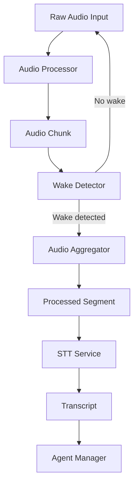

<!-- markdownlint-disable-next-line MD041 -->
> Docs ▸ Architecture ▸ Audio Pipeline

# Audio Pipeline Architecture

The audio pipeline is the core processing engine that transforms raw audio input into structured data for agent processing. It handles audio conversion, normalization, wake detection, and streaming.

## Pipeline Overview



## Core Components

### Audio Processor

The `AudioProcessor` handles format conversion and audio enhancement:

```python
class AudioProcessor:
    """Processes audio chunks for optimal transcription."""
    
    async def process_audio_chunk(
        self, 
        chunk: AudioChunk
    ) -> ProcessedSegment:
        """Convert and enhance audio chunk."""
        # Format conversion
        # Resampling
        # Normalization
        # Noise reduction
        # Quality metrics
```

**Key Features:**
- **Format Conversion**: Supports multiple input formats (PCM, WAV, MP3, etc.)
- **Resampling**: Converts to optimal sample rate for STT
- **Normalization**: Adjusts volume levels for consistent processing
- **Noise Reduction**: Filters background noise and artifacts
- **Quality Metrics**: Calculates audio quality indicators

### Wake Detector

The `WakeDetector` identifies when users are speaking to the system:

```python
class WakeDetector:
    """Detects wake phrases and speech activity."""
    
    async def detect_wake_phrase(
        self, 
        audio_segment: AudioChunk
    ) -> bool:
        """Check if wake phrase is present."""
        # Energy analysis
        # Complexity metrics
        # Pattern matching
        # Confidence scoring
```

**Detection Methods:**
- **Energy Analysis**: Detects speech activity through audio energy
- **Complexity Metrics**: Analyzes audio complexity patterns
- **Pattern Matching**: Recognizes specific wake phrases
- **Confidence Scoring**: Provides confidence levels for detection

### Audio Aggregator

The `AudioAggregator` collects audio segments for processing:

```python
class AudioAggregator:
    """Aggregates audio segments for transcription."""
    
    async def aggregate_audio(
        self, 
        audio_chunks: List[AudioChunk]
    ) -> ProcessedSegment:
        """Combine audio chunks into complete segments."""
        # Chunking logic
        # Buffer management
        # Segment validation
        # Quality checks
```

**Aggregation Features:**
- **Smart Chunking**: Combines audio into optimal segments
- **Buffer Management**: Handles memory-efficient buffering
- **Segment Validation**: Ensures audio quality and completeness
- **Quality Checks**: Validates segments before transcription

## Pipeline Stages

### Stage 1: Audio Input
- Raw audio captured from adapters
- Initial format detection and validation
- Basic quality assessment

### Stage 2: Audio Processing
- Format conversion to standard format
- Resampling to optimal sample rate
- Volume normalization
- Noise reduction and enhancement

### Stage 3: Wake Detection
- Continuous monitoring for wake phrases
- Speech activity detection
- Confidence scoring and validation

### Stage 4: Audio Aggregation
- Collection of audio segments
- Smart chunking for optimal transcription
- Quality validation and filtering

### Stage 5: Transcription
- Audio segments sent to STT service
- Transcript generation and validation
- Confidence scoring and error handling

## Configuration

### Audio Processing Settings

```bash
# Audio Pipeline Configuration
AUDIO_SAMPLE_RATE=16000
AUDIO_CHANNELS=1
AUDIO_CHUNK_SIZE_MS=20
AUDIO_BUFFER_SIZE_CHUNKS=5

# Wake Detection Settings
WAKE_DETECTION_ENABLED=true
WAKE_PHRASE="hey assistant"
WAKE_CONFIDENCE_THRESHOLD=0.8
WAKE_TIMEOUT_MS=3000

# Audio Quality Settings
AUDIO_NORMALIZATION_ENABLED=true
AUDIO_NOISE_REDUCTION_ENABLED=true
AUDIO_QUALITY_THRESHOLD=0.7
```

### Performance Tuning

```bash
# Performance Settings
AUDIO_PROCESSING_THREADS=4
AUDIO_BUFFER_POOL_SIZE=10
AUDIO_CACHE_SIZE_MB=100
AUDIO_PROCESSING_TIMEOUT_MS=5000
```

## Error Handling

### Audio Quality Issues
- **Low Quality**: Automatic retry with enhanced processing
- **Noise Detection**: Noise reduction and filtering
- **Format Issues**: Automatic format conversion
- **Corruption**: Error logging and graceful degradation

### Performance Issues
- **Buffer Overflow**: Automatic buffer management
- **Processing Delays**: Timeout handling and fallback
- **Memory Issues**: Garbage collection and cleanup
- **Resource Limits**: Adaptive processing and throttling

## Monitoring and Metrics

### Key Metrics
- **Audio Quality**: Signal-to-noise ratio, clarity scores
- **Processing Latency**: End-to-end processing time
- **Wake Detection**: Accuracy and false positive rates
- **Resource Usage**: CPU, memory, and I/O utilization

### Health Checks
- **Audio Pipeline Health**: Processing status and performance
- **Component Health**: Individual component status
- **Resource Health**: Memory and CPU utilization
- **Quality Health**: Audio quality metrics and trends

## Integration Points

### Adapter Integration
- **Input Adapters**: Receive audio from various sources
- **Output Adapters**: Send processed audio to destinations
- **Format Support**: Multiple audio format handling
- **Quality Control**: Consistent audio quality across sources

### Service Integration
- **STT Service**: Optimized audio segments for transcription
- **Agent Framework**: Context-aware audio processing
- **Monitoring**: Comprehensive metrics and health checks
- **Configuration**: Dynamic configuration updates

## Best Practices

### Audio Quality
- **Consistent Sampling**: Use standard sample rates
- **Noise Reduction**: Implement appropriate filtering
- **Volume Normalization**: Maintain consistent levels
- **Format Optimization**: Choose optimal formats for processing

### Performance
- **Buffer Management**: Efficient memory usage
- **Processing Optimization**: Minimize latency
- **Resource Management**: Monitor and limit resource usage
- **Error Recovery**: Graceful handling of failures

### Monitoring
- **Quality Metrics**: Track audio quality trends
- **Performance Metrics**: Monitor processing latency
- **Error Tracking**: Log and analyze errors
- **Health Monitoring**: Continuous health assessment
