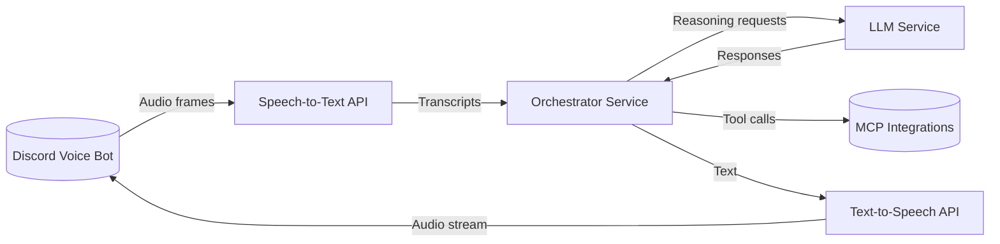

<!-- markdownlint-disable-next-line MD041 -->
> Docs ▸ Architecture ▸ System Overview

# System Overview

The Discord Voice Lab combines five core services to transform live Discord audio into orchestrated
actions and synthesized responses.

## Topology

## Service Responsibilities

| Service | Role | Key Technologies |
| --- | --- | --- |
| `services/discord` | Captures Discord voice, detects wake phrases, forwards audio to STT, plays TTS output, exposes MCP tools. | `discord.py`, `faster-whisper`, MCP SDKs. |
| `services/stt` | Hosts the speech-to-text API backed by faster-whisper for streaming transcription. | FastAPI, `faster-whisper`. |
| `services/orchestrator` | Coordinates transcript processing, MCP tool calls, and response planning. Routes reasoning requests to LLM service. | FastAPI, MCP SDKs. |
| `services/llm` | Provides OpenAI-compatible completions and reasoning capabilities for the orchestrator. | FastAPI, llama.cpp executor. |
| `services/tts` | Streams Piper-generated audio for orchestrator responses with authentication and rate limits. | FastAPI, Piper. |

## Data Flow

1. The Discord bot captures PCM audio once a wake phrase is detected.
2. Audio segments are streamed to the STT service, which returns transcripts.
3. Transcripts feed the orchestrator, which coordinates MCP tool calls and routes reasoning requests to the LLM service.
4. The LLM service processes reasoning requests and returns responses to the orchestrator.
5. For spoken replies, the orchestrator calls the TTS service and returns the resulting audio to Discord.
6. Observability flows through shared structured logging helpers and optional `/metrics` endpoints.

## Integration Points

- **Model Context Protocol (MCP)** — Register manifests via `MCP_MANIFESTS`, WebSocket URLs, or command handlers to expose automation tools.
- **Discord tokens** — Configure via `services/discord/.env.service` with guild and channel identifiers.
- **Llama.cpp runtime** — Tuned through `services/llm/.env.service` to set model paths, context size, and threading.
- **LiveKit integration** — Planned future capability for enhanced real-time audio processing and multi-participant voice interactions.

For deeper service details, explore the [service deep dives](service-deep-dives/discord.md) and the
[MCP integration appendix](integration/mcp.md).
