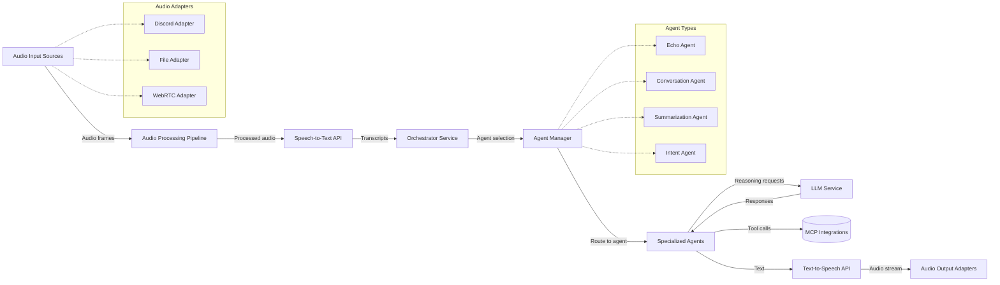

<!-- markdownlint-disable-next-line MD041 -->
> Docs ▸ Architecture ▸ System Overview

# System Overview

<!-- markdownlint-disable MD013 -->
The Audio Orchestrator platform combines five core services with a flexible adapter and agent framework to transform live audio input into orchestrated actions and synthesized responses. The platform supports multiple audio sources through pluggable adapters and intelligent response generation through specialized agents.
<!-- markdownlint-enable MD013 -->

## Topology

## Service Responsibilities

| Service | Role | Key Technologies |
| --- | --- | --- |
| `services/discord` | Discord voice adapter implementation, captures voice, detects wake phrases, forwards audio to STT, plays TTS output, exposes MCP tools. | `discord.py`, `faster-whisper`, MCP SDKs. |
| `services/stt` | Hosts the speech-to-text API backed by faster-whisper for streaming transcription. | FastAPI, `faster-whisper`. |
| `services/orchestrator_enhanced` | Coordinates audio pipeline, agent management, transcript processing, LangChain tool calls, and response planning. Routes reasoning requests to LLM service. | FastAPI, LangChain SDKs, Agent Framework. |
| `services/llm_flan` | Provides OpenAI-compatible completions and reasoning capabilities for the orchestrator. | FastAPI, FLAN-T5 executor. |
| `services/tts_bark` | Streams Bark-generated audio for orchestrator responses with authentication and rate limits. | FastAPI, Bark. |

## Adapter Framework

The platform uses a pluggable adapter architecture to support multiple audio input and output sources:

### Audio Input Adapters

-  **Discord Adapter**: Captures voice from Discord voice channels
-  **File Adapter**: Processes audio from files for testing and debugging
-  **WebRTC Adapter**: Future support for real-time web audio

### Audio Output Adapters

-  **Discord Adapter**: Plays audio to Discord voice channels
-  **File Adapter**: Saves audio output to files
-  **WebRTC Adapter**: Future support for real-time web audio output

## Agent Framework

The platform uses a flexible agent system for intelligent response generation:

### Built-in Agents

-  **Echo Agent**: Simple echo responses for testing
-  **Conversation Agent**: Natural multi-turn conversations using LLM
-  **Summarization Agent**: Summarizes conversation history
-  **Intent Agent**: Classifies user intent and routes to specialized agents

### Agent Capabilities

-  **Context Management**: Maintains conversation history and session state
-  **LLM Integration**: Routes reasoning requests to LLM service
-  **MCP Tool Integration**: Executes external actions through MCP tools
-  **Response Generation**: Generates text and audio responses

## Data Flow

1.  **Audio Input**: Audio adapters capture audio from various sources (Discord, files, WebRTC)
2.  **Audio Processing**: Audio pipeline processes raw audio through conversion, normalization, and wake detection
3.  **Speech-to-Text**: Processed audio is sent to STT service for transcription
4.  **Agent Selection**: Orchestrator uses agent manager to select appropriate agent based on transcript and context
5.  **Agent Processing**: Selected agent processes the transcript and may call LLM service for reasoning
6.  **Response Generation**: Agent generates response text and may call MCP tools for external actions
7.  **Text-to-Speech**: Response text is sent to TTS service for audio synthesis
8.  **Audio Output**: Generated audio is sent through output adapters to appropriate destinations
9.  **Context Management**: Conversation context is updated and persisted for future interactions
10.  **Observability**: All stages are monitored through structured logging and metrics endpoints

## Integration Points

-  **Model Context Protocol (MCP)** — Register manifests via `MCP_MANIFESTS`, WebSocket URLs, or command handlers to expose automation tools.
-  **Discord tokens** — Configure via `services/discord/.env.service` with guild and channel identifiers.
-  **Llama.cpp runtime** — Tuned through `services/llm/.env.service` to set model paths, context size, and threading.
-  **LiveKit integration** — Planned future capability for enhanced real-time audio processing and multi-participant voice interactions.

For deeper service details, explore the [service deep dives](service-deep-dives/discord.md) and the
[MCP integration appendix](integration/mcp.md).
