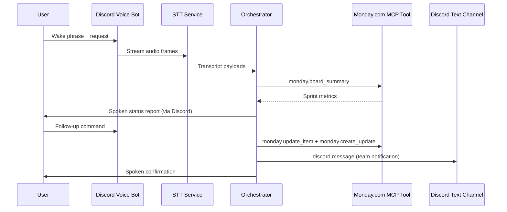
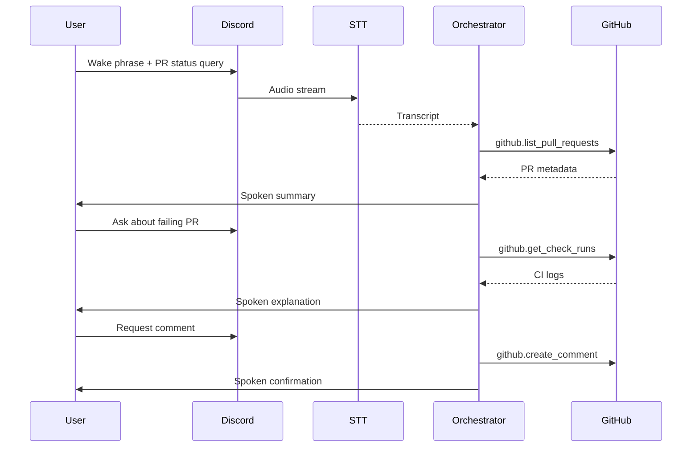
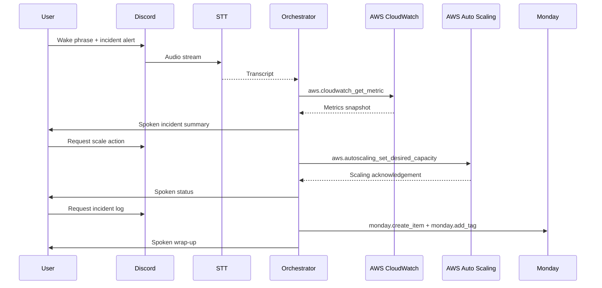
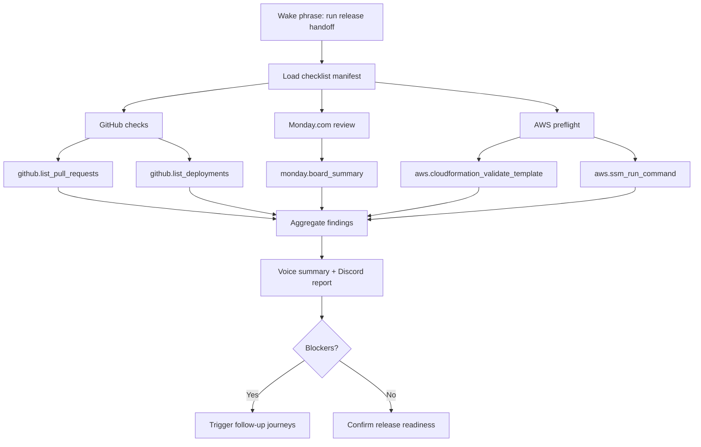

# Discord Voice MCP User Journeys

## Overview

This guide outlines sample user journeys that illustrate how Discord Voice interactions combine with
Model Context Protocol (MCP) tooling to automate work across Monday.com, GitHub, and AWS. Each
journey highlights the user intent, the orchestration steps across services, and how results are
surfaced back to the user via voice.

## Journey 1: Sprint Planning via Monday.com

### Scenario — Sprint Planning

A project manager wants to check the status of the current sprint, update a task, and notify the
team about a change.

### Step-by-step Experience — Sprint Planning

1. **Wake Phrase** – The manager says, "Hey Voice Lab, how is Sprint 24 progressing?"
2. **Transcription** – The Discord bot streams audio to the STT service, which emits text to the
   orchestrator.
3. **Intent Parsing** – The orchestrator identifies the request as a Monday.com board summary.
4. **Tool Invocation** – The orchestrator calls `monday.board_summary` via MCP with board ID and
   filter parameters.
5. **Reasoning** – The orchestrator synthesizes a spoken summary detailing completed vs. remaining
   items.
6. **Follow-up Action** – The manager replies, "Move the API hardening task to In Review and add a
   note that QA approved the test plan."
7. **State Update** – The orchestrator invokes `monday.update_item` and `monday.create_update` to
   modify status and append the note.
8. **Team Notification** – The manager says, "Let the team know." The orchestrator triggers
   `discord.message` to post a channel update summarizing the change.
9. **Voice Response** – The bot confirms verbally: "Sprint 24 is on track. The API hardening task is
   now In Review with QA approval, and the team has been notified."

### Sequence Diagram — Sprint Planning

### Outstanding Implementation Needs — Sprint Planning

* **Monday.com MCP coverage** – Build and register the `monday.board_summary`,
  `monday.update_item`, and `monday.create_update` tools with schemas that map
  sprint metadata, status transitions, and note payloads.
* **Discord text bridge** – Expose a `discord.message` MCP action that can post
  templated summaries to specific channels while honoring project-level access
  controls.
* **Conversation memory** – Persist short-term context so the orchestrator can
  interpret follow-up instructions (e.g., "Move the API hardening task") without
  requiring the user to restate identifiers.
* **Voice confirmation prompts** – Implement confirmation heuristics for
  high-impact task changes, especially when moving work between critical sprint
  states.

## Journey 2: GitHub Code Review Assistant

### Scenario — GitHub Code Review

An engineer requests a quick summary of open pull requests, inspects CI failures, and instructs the
AI to add a comment to a PR.

### Step-by-step Experience — GitHub Code Review

1. **Wake Phrase** – "Hey Voice Lab, what open PRs do we have for the voice bot?"
2. **Intent Parsing** – The orchestrator calls `github.list_pull_requests` scoped to the repository
   and branch filters configured for the Discord channel.
3. **Voice Summary** – The bot enumerates key PRs, including authors, status, and review blockers.
4. **Deep Dive** – The engineer asks, "Why is PR #142 failing?" The orchestrator invokes
   `github.get_check_runs` and collates the failing CI job logs.
5. **Reasoning** – The orchestrator summarizes the failure: "Integration tests failed because the STT
   mock timed out."
6. **Action Request** – The engineer says, "Add a comment asking for a retry after updating the
   mock." The orchestrator composes the comment and calls `github.create_comment`.
7. **Confirmation** – The bot responds, "Posted a comment on PR #142 requesting a retry with the
   refreshed mock configuration."

### Sequence Diagram — GitHub Code Review

### Outstanding Implementation Needs — GitHub Code Review

* **GitHub tool surface** – Implement authenticated MCP tools for listing pull
  requests, retrieving check runs, and posting comments with robust pagination
  and retry logic.
* **CI log summarization** – Add a summarization skill that can condense failing
  job logs into voice-ready explanations while linking back to the raw artifacts
  in Discord.
* **Repository scoping** – Configure workspace-to-repository mappings so voice
  requests automatically target the correct GitHub organization, repo, and
  branch set.
* **Review safety rails** – Enforce policy checks before comments are posted on
  behalf of the user, including optional confirmation for write actions.

## Journey 3: AWS Incident Response

### Scenario — AWS Incident Response

A DevOps responder detects elevated latency in production and uses voice to triage, scale, and log
an incident report.

### Step-by-step Experience — AWS Incident Response

1. **Wake Phrase** – "Hey Voice Lab, latency is spiking. What do you see in prod?"
2. **Telemetry Query** – The orchestrator calls `aws.cloudwatch_get_metric` for the relevant service
   metrics and correlates them with MCP-provided alerts.
3. **Incident Context** – The bot replies with latency graphs, error counts, and impacted regions via
   a spoken summary and optional Discord embed (`discord.embed`).
4. **Scaling Action** – The responder says, "Scale the web tier to 6 instances." The orchestrator
   validates policy rules, then invokes `aws.autoscaling_set_desired_capacity`.
5. **Verification** – Once AWS confirms the change, the orchestrator monitors metrics for recovery
   and communicates status back to the user.
6. **Postmortem Note** – The responder instructs, "Log an incident in Monday.com and tag the SRE
   board." The orchestrator calls `monday.create_item` with incident details and `monday.add_tag`.
7. **Wrap-up** – The bot confirms: "Autoscaling applied and incident V-217 logged in Monday.com.
   Latency is trending back toward baseline."

### Sequence Diagram — AWS Incident Response

### Outstanding Implementation Needs — AWS Incident Response

* **Observability hooks** – Integrate MCP tools for CloudWatch metric queries
  and alert introspection, including rate limiting and standardized incident
  payloads.
* **Automated runbooks** – Define policy-aware autoscaling actions with guard
  rails (desired capacity bounds, IAM role validation, rollback triggers) that
  the orchestrator must satisfy before execution.
* **Incident logging workflow** – Implement Monday.com incident templates and
  tagging conventions so voice-initiated incidents stay consistent with manual
  entries.
* **Multichannel response** – Add Discord embed generation for incident context
  (graphs, impact summaries) to complement the spoken response.

## Journey 4: Cross-Service Release Handoff

### Scenario — Cross-Service Release Handoff

A tech lead prepares for a release by gathering GitHub deployment readiness, Monday.com blockers,
and AWS preflight checks in a single voice-driven session.

### Step-by-step Experience — Cross-Service Release Handoff

1. **Wake Phrase** – "Hey Voice Lab, run the release handoff checklist for version 2.3."
2. **Checklist Expansion** – The orchestrator loads a stored MCP manifest describing the checklist
   steps and associated tools.
3. **GitHub Verification** – It calls `github.list_pull_requests` and `github.list_deployments` to
   confirm merge status and deployment windows.
4. **Monday.com Review** – It invokes `monday.board_summary` filtered to "Release 2.3" tasks,
   capturing blockers and outstanding QA items.
5. **AWS Preflight** – It executes `aws.cloudformation_validate_template` and
   `aws.ssm_run_command check-preflight` to ensure infrastructure readiness.
6. **Consolidated Report** – The orchestrator compiles findings into a structured response delivered
   via voice, plus a Markdown report posted to the release channel (`discord.message`).
7. **Next Steps** – If blockers exist, the user can immediately branch into one of the previous
   journeys (e.g., update Monday.com tasks or notify engineers) without leaving the conversation.

### Flow Diagram

### Outstanding Implementation Needs — Cross-Service Release Handoff

* **Checklist manifest engine** – Create a reusable manifest format and loader
  that defines release steps, required tools, and success criteria the
  orchestrator can evaluate.
* **Cross-service aggregation** – Build a reporting pipeline that merges GitHub,
  Monday.com, and AWS findings into a unified structure suitable for both voice
  narration and Markdown handoff notes.
* **Blocker escalation** – Implement branching logic that routes detected
  blockers into follow-up workflows (e.g., creating tasks, paging owners) while
  maintaining conversation context.
* **Access governance** – Ensure the orchestrator verifies the user's release
  role before executing deployment-sensitive AWS or GitHub operations.

## Key Design Considerations

* **MCP Manifests** – Keep tool definitions declarative so the orchestrator can dynamically compose
  workflows as user needs evolve.
* **Context Windows** – Retain conversational memory across journeys, enabling users to chain
  Monday.com updates, GitHub reviews, and AWS operations naturally.
* **Safety and Audit** – Enforce role-based access, log all MCP calls, and require confirmation for
  destructive actions.
* **Multimodal Feedback** – Pair spoken summaries with Discord text embeds or attachments for
  complex data (metrics snapshots, PR diffs, incident IDs).
* **Fallback Strategies** – Provide escalation paths when a tool is unavailable (e.g., queue the
  request, notify on-call, or guide the user to manual steps).
